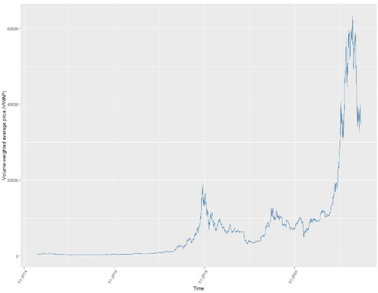
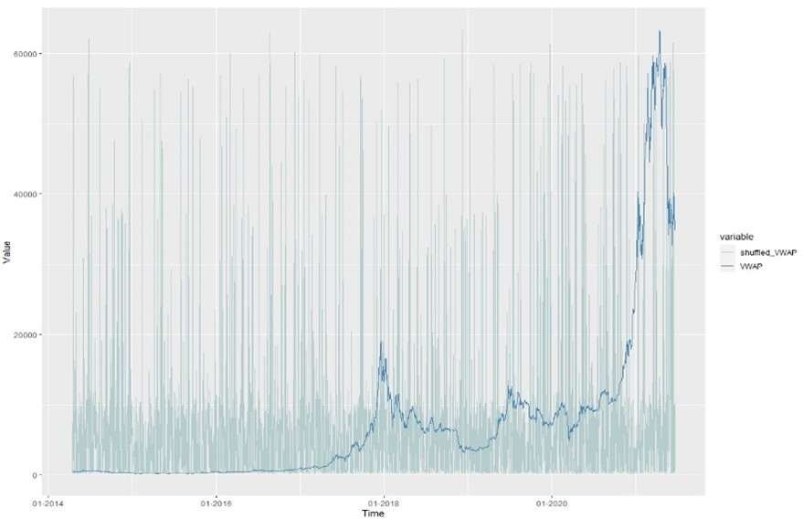

**Issues with classical XAI methods**

Classical approaches and their current implementation are not tailored for financial data hence their applicability in this domain is limited. Key limitation of many classical methods is the fact that they ignore feature dependence which is a defining property of financial data. Specifically, the procedures of perturbation-based methods like the PDP, PFI, SHAP, LIME, etc., start with producing artificial data points, obtained either through replacement with permuted or randomly select values from the background data; or through the generation of new "fake" data, that are consequently used for model predictions. Such step results in several concerns:

-   if features are correlated, the artificial coalitions created will lie outside of the multivariate joint distribution of the data,

-   if the data are independent, coalitions can still be meaningless; perturbation-based methods are fully dependent on the ability to perturb samples in a meaningful way which is not always the case with financial data (ex. one-hot encoding)

-   generating artificial data points through random replacement disregards the time sequence hence producing unrealistic values for the feature of interest.

In this specific example, the SHAP calculation is made by evaluating the model's prediction for different coalitions of the 6 inputs (six lagged returns). For example, the vector of (1,1,1,0,1,0) means that we have a coalition of the first, second, third and fifth lag. The K sampled coalitions become the dataset for the regression model. The target for the regression model is the prediction for a coalition. But since the model has not been trained on these binary coalition data and cannot make predictions for them, so it has to maps 0's to the values of another instance that we sample from the data. This means that we equate "feature value is absent" with "feature value is replaced by random feature value from data". Ultimately, it means that in the different coalitions we have shuffled values of the inputs which do not preserve the natural time ordering that fundamentally characterizes financial time series data.

