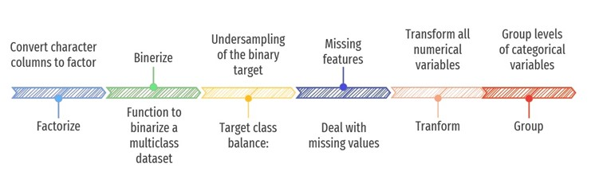
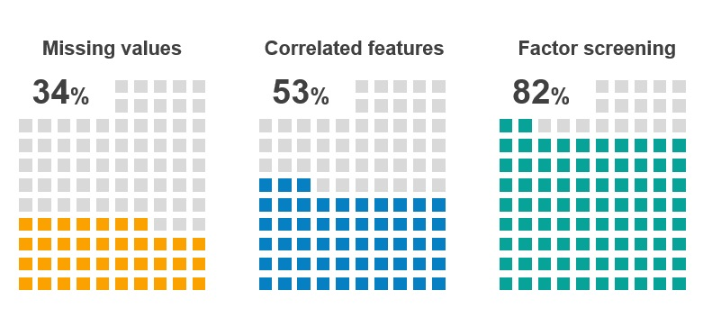
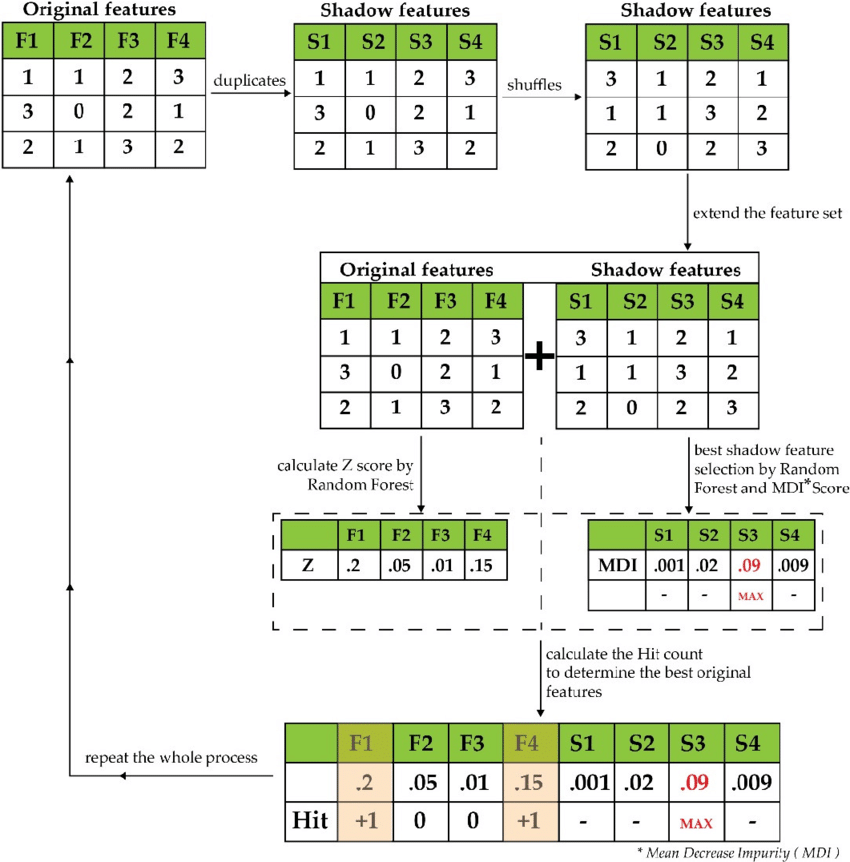

The raw data used in this use case covers **2.2 million loan contracts** originated by the P2P lending platform Lending Club. The raw data further contained information on \~160 features for the individual loan contracts included. The size of the raw dataset was \~2GB. The original dataset is open source, and it is available at the following link: <https://www.kaggle.com/datasets/wordsforthewise/lending-club>

The raw dataset was characterized with many data quality issues among which significant presence of missing values, imbalanced representation of levels within categorical features, outliers, etc. In this context the research team carried out a **3-step process of improving the data quality.**

**Step 1. Initial data pre-processing.** The activities taken within this step are visualized below.

 

**Step 2. Initial feature selection.** Within this step, we carried out various activities so to deal with features that:

-   have significant presence of missing values,

-   are highly correlated (correlation > 90%),

-   have significant number of levels which are not sufficiently represented.

 

**Step 3. Advanced feature selection.** In order to further restrain the dimensions of the dataset, we ran the Boruta algorithm so to identify features that can be excluded from the input specification.

 

The implementation (script) of each of the 3 steps discussed, can be found at the following link: <https://github.com/branka1509/XAIFINANCE/tree/main/Credit%20risk%20modelling%20use%20case/notebooks>
