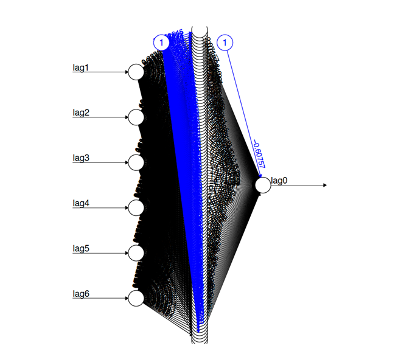
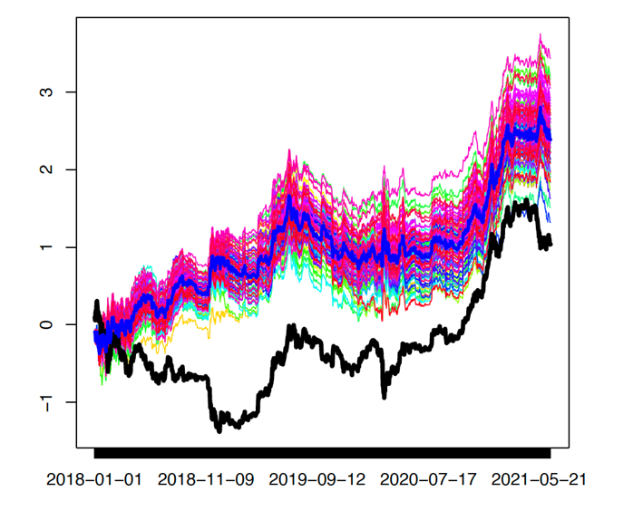

## Overview

This tab allows you to explore the performance of a simple neural network (NN) trained to predict the Bitcoin daily return by using 6 lagged returns as inputs. For this experiment, we choose a very simple architecture of the NN: 1 hidden layer with 100 hidden neurons. Hence, the number of estimated parameters amounts to a total of 6\*100 + 100 = 700 weights and 100+1 = 101 biases.

## Visualization of the trained model

## {width="75%"}

**Image 1:** Neural net BTC: feedforward net with a single hidden-layer of dimension 100 and an input layer of dimension 6 comprising the last six lagged returns

## Trading performance

Next, we optimize the net 100-times, based on different random initializations of its parameters, and we compute trading performances of each random-net based on the simple sign-rule: buy or sell tomorrow's return depending on the sign of the NN's forecast. We further, compare the performance of the NN with a simple buy-and-hold strategy. The resulting cohort of cumulated (out-of-sample) trading performances is displayed in the Figure below with the mean-performance in the center (bold blue line). Remarkably, even the least performing net outperforms the buyand-hold benchmark (lower black line) in the considered out-of-sample span and the net-cohort systematically mitigates draw-downs of the BTC at the expense of slightly weaker growth during hefty upswings.

{width="75%"}

**Image 2:** Cumulated log-performances out-of-sample based on sign-rule (buy or sell depending on sign of forecasted return): 'random' neural nets (colored) vs. buy-and-hold (bold black) and mean-net performance (bold blue)

While the above figure suggests a fairly broad range of ’random’ trading-realizations, the aggregate mean has stabilized and is virtually invariant to the particular random-seed selected for parameter initialization. We now address the problem of picking-out the best possible out-of-sample random-net based on historical in-sample performances. For this purpose table 2 reports correlations between in-sample and out-of-sample forecast and trading-performances: a strong correlation indicates that the best in-sample net is likely to perform well out-of-sample, too. The table suggests that out-of-sample trading performances are not directly related to in-sample forecast- or trading performances so that the aggregate mean, assigning equal weight to each of the 100 random-nets in the figure above is a valuable strategy, at least in the absence of further empirical evidences; moreover this strategy is virtually invariant to the random seed of parameter initialization(s). 
