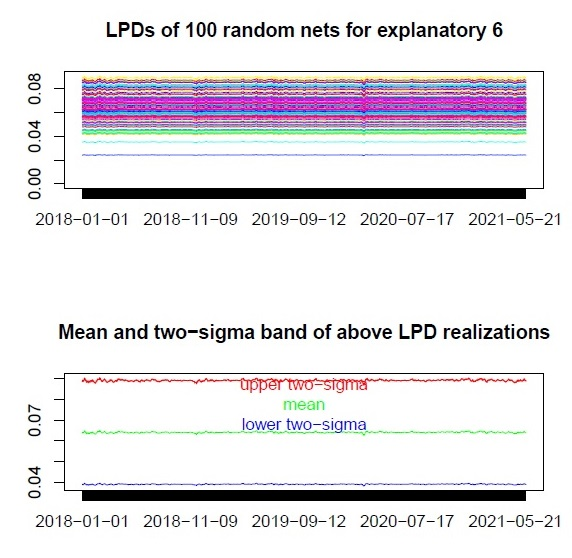
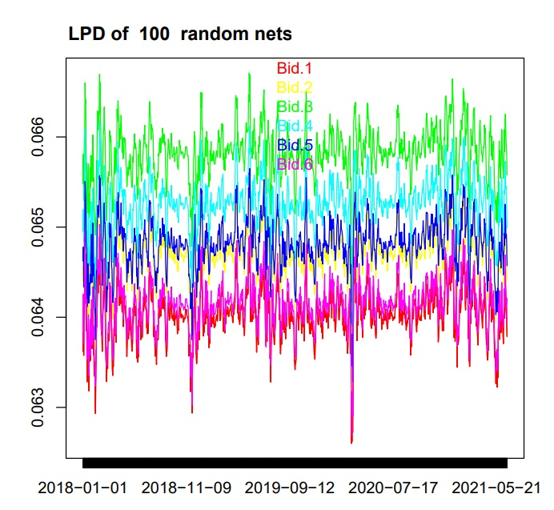
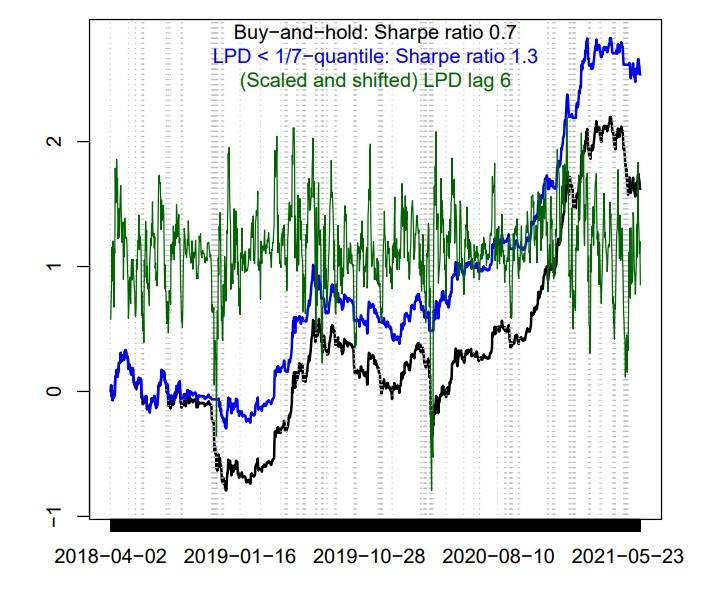

## Overview
In this tab you can explore the overall utility of the LPD approach proposed in this use case both in terms of explainability for network networks applied to financial time series as well as for risk management in general.

## Interpretability 

For ease of exposition we first display the random realizations of the last column of the LPD only, corresponding to the lag-six return $r_{t-6}$. The lower panel in the figure displays the corresponding mean-LPD $\overline{LPD}_{t,6}$, together with empirical two-sigma bands $\overline{LPD}_{t,6}\pm 2\sigma_{t,6}$, where

$$\overline{LPD}_{t,6}:=\frac{1}{100}\sum_{i=1}^{100} LPD_{t,6i}$$
$$\sigma_{t,6}:=\frac{1}{100}\sum_{i=1}^{100}(LPD_{t,6i}-\overline{LPD}_{t,6})^2$$

and  where $LPD_{t,6i}$ is the LPD of the lag-6 variable of the $i$-th random net.

{width="40%"}
**Image 3:** Out-of-sample random LPDs of the lag-6 BTC input variable (top) and mean-LPD with empirical two-sigma band (bottom)

Interestingly, given the richly parameterized net structure, the plot suggests nearly constant sensitivities along the time axis, as could be ascribed to an ordinary linear model, at least up to the random-effects due to parameter initialization. Moreover, these findings are confirmed across all explanatory variables, as can be seen in Figure 4 which displays the corresponding mean LPDs. 

{width="50%"}

**Image 4:** Out-of-sample mean LPD: means are taken for each explanatory variable over all random nets

In order to summarize our findings we then introduce the mean net-output:

$$\overline{o}_t=\frac{1}{100}\sum_{i=1}^{100} o_{t,i}=\overline{\mathbf{LPD}}_t \left(\begin{array}{cc}&1\\&\mathbf{x}_t\end{array}\right)\approx 0.0015 +0.065\sum_{j=1}^6 x_{jt}$$

where $\overline{\mathbf{LPD}}_t$ is the vector of mean-intercept and mean-LPDs.

We then infer that the consensus-forecast $\overline{o}_t$ of the random-nets can be approximated by an unassuming equally-weighted MA(6) forecast-heuristic, with constant weights, shifted by a small intercept. In this sense, the proposed mean-LPD effectively resolves both the black-box non-linearity of the richly parameterized net as well as the indeterminacy and randomness of  parameter estimates. Interestingly, the equally-weighted MA(6) was already identified as a successful strategy for the BTC in  other studies. As a result of the above explainability effort, we can ascribe trustworthiness to the consensus forecast of the armada of random-nets by relating it to a simple forecast heuristic.

## Explainability - further consideration  
Since the LPD corresponds to the parameters of a (time-dependent) linear replication of the net, synthetic t-statistics could be computed for inferring the relevance of the explanatory variables by computing the ratio of mean-LPD and standard-deviation.
$$t_t∶=LPD_t / \sigma_t$$

at each time point t, corresponding to (a vector of) synthetic t-statistics, one for each input variable. This in turn, means that we can obtain a mean magnitude of impact of the individual inputs and a statistical test of the importance of this feature. Most importantly, the inferred importance was not obtained though a perturbation-based methods but rather though an approach that respects and preserves the natural time ordering in the data. 

## Financial risk management

Our initial insights suggest that the time-varying dependency of the data measured by the LPDs is indicative of different states of the market. In particular weak dependency (small absolute LPD) is an indicator of randomness or  ‘chaos’ (see figure below). If we put this into a financial risk management context, we can use the signals from the LPD to direct our trading strategy. Specifically, we can propose a simple rule for managing risks: exit markets at times tagged as chaotic by the LPD. Put differently, a market-exit (cash-position) is triggered when the dependence structure of the data, as measured by the LPD, is weakening or, in other words, when the net-forecast is less conclusive about next-day's return. In order to formalize the 'weakness' concept we assume first that exit-signals have a probability of 1/7, one per week in the mean, which reflects the frequent occurrence of local bursts or disruptions of the BTC: a market exit is then triggered if the LPD drops below its empirical $1/7$-quantile. The computation of the quantile is based on a rolling-window of length 100 days, corresponding roughly to the last quarter of observations: we argue that a quarter of data is sufficiently long for resolving the corresponding tail of the distribution, at least with respect to the 1/7-quantile, and it is short enough to adapt for possible structural changes in the BTC. Finally, we cross-check the proposed RM monitoring-tool by analyzing crossings of the mirrored 1-1/7 upper quantile by the LPD, corresponding to unusually strong dependence (see the two figures below). A direct comparison of market-exits in the figures suggests that weak data dependence (LPD below lower quantile) matches by the majority down-turns of the BTC and conversely strong data dependence (LPD above upper quantile) matches by the majority up-turns, thus confirming the original intent and rationale of the proposed RM-strategy. 

{width="50%"}

**Image 5:** Buy-and-hold (black) vs. out-of-sample (mean-) LPD market-exit strategy (blue): exits (shaded in grey) occur if today’s out-of-sample (absolute) mean-LPD (green) drops below the 1/7- quantile based on a rolling-window of length one quarter of its own history. The LPD corresponding
to the lag-6 BTC-value is used. 

{width="50%"}

**Image 6:** Buy-and-hold (black) vs. Out-of-sample (mean-) LPD market-exit strategy (red): exits (shaded in grey) occur if today’s out-of-sample (absolute) mean-LPD (green) exceeds the upper 1-1/7 quantile based on a rolling-window of length one quarter of its own history. The LPD corresponding to the lag-6 BTC-value is used
